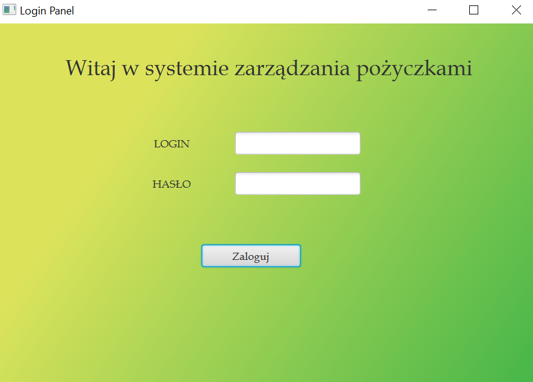

## Loan_Management_System_Calculator - projket systemu zarządzania pożyczkami.
#### Zaprojektowany w języku Java z wykorzystaniem elemementów JavaFX. 
#### Po sklonowaniu aplikacji uruchamiamy ją w dowolnym idea np. IntelliJ IDEA Ultimate. Aplikację uruchamiamy za pomoca klasy HelloControler.java (ścieżka do pliku src/main/java/com/example/loanmanagementsystemcalculator/HelloController.java).
#### Po uruchomieniu aplikacji, użytkownikowi ukazuje się panel logowania, do którego login i hsało znajdują się w floderze Users.

#### Następnie użytkownik zostaje przekierowany do głównego panelu systemu i ma następujące możliwości:
* Kalkulator pożyczek
  - Działa po wczęśniejszym wprowadzeniu danych: 
    - wysokość oprocentowania, 
    - na ile lat ma być pożyczka
    - wysokość pożyczki.
* Wygeneruj paragon
* Zapisz
* Wyczyść kalkulator
* Zamknij kalkulator
