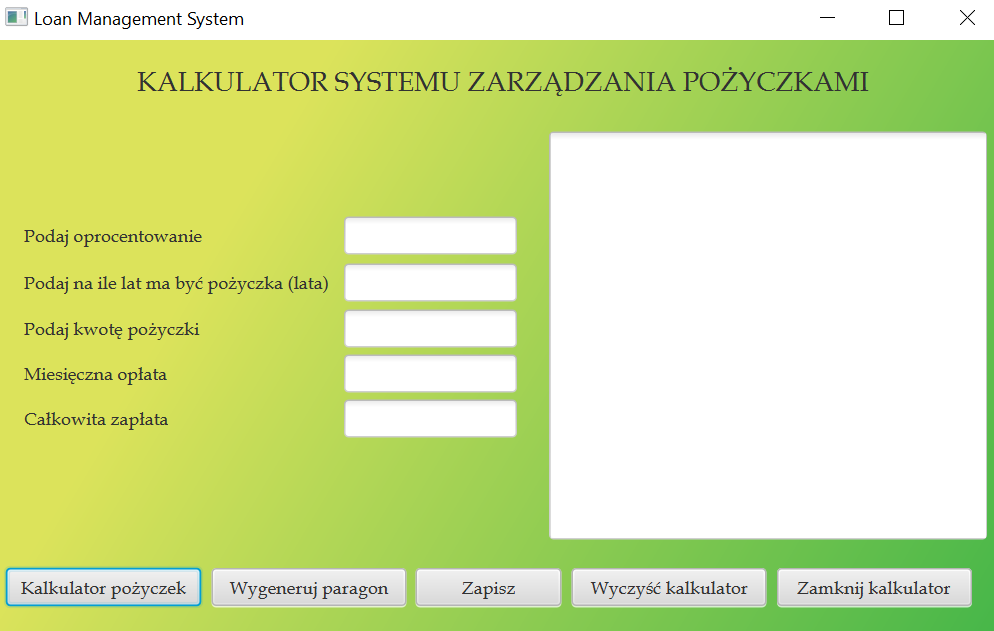
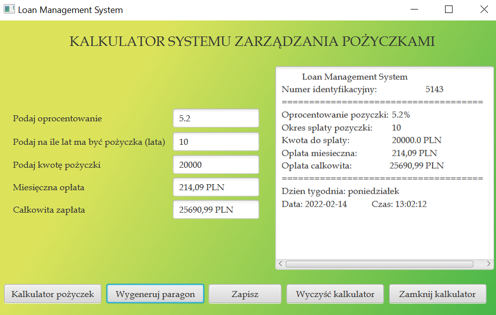
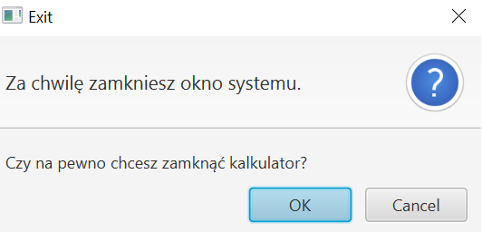

## Loan_Management_System_Calculator - projket systemu zarządzania pożyczkami.
#### Zaprojektowany w języku Java z wykorzystaniem elemementów JavaFX. 
#### Po sklonowaniu aplikacji uruchamiamy ją w dowolnym idea np. IntelliJ IDEA Ultimate. Aplikację uruchamiamy za pomoca klasy HelloControler.java *(ścieżka do pliku src/main/java/com/example/loanmanagementsystemcalculator/HelloController.java)*.
#### Po uruchomieniu aplikacji, użytkownikowi ukazuje się panel logowania, do którego login i hsało znajdują się w floderze Users.

#### Następnie użytkownik zostaje przekierowany do głównego panelu systemu i ma następujące możliwości:
* Kalkulator pożyczek
  - Działa po wczęśniejszym wprowadzeniu danych: 
    - wysokość oprocentowania, 
    - na ile lat ma być pożyczka
    - wysokość pożyczki.
* Wygeneruj paragon
  - Wygenerowanie paragonu będzie możliwe po obliczeniu wysokości rat wzietej pożyczki oraz po obliczeniu całkowitej kwoty pożyczki.
* Zapisz
  - Zapisanie paragonu będzie możliwe po jego wygenerowaniu. 
  - Paragon zostanie zapisany w formie pliku tekstowego do folderu o nazwie Paragony.

                                                                                                                                   
* Wyczyść kalkulator
  - Po wyczyszczeniu kalkulatora użytkownik ma możliwość ponownego wyliczenia rat i całkowitego kosztu pożyczki, co pozwoli mu następnie na ponowne wygenerowanie paragonu dla nowych danych.
 
* Zamknij kalkulator
  - Użytkownikowi pokazuje się końcowy panel systemu, pozwalający mu na zamknięcie głównego okna systemu.
  

W ramach projektu aplikacji, zostały utworzone testy jednostkowe w klasie HelloControllerTest.java *(ścieżka do pliku src/test/java/com/example/loanmanagementsystemcalculator/HelloControllerTest.java)*. Jeden z testów został przygotowany w taki sposób, aby nie przechodził poprawnie.

  
